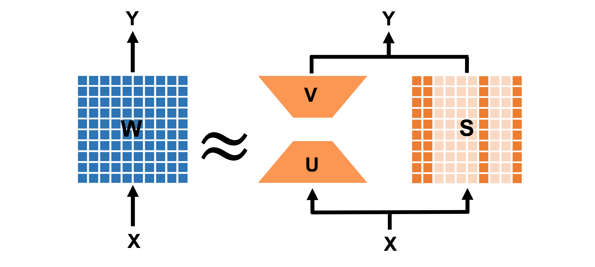

# LoSparse


This pytorch package implements [LoSparse: Structured Compression of Large Language Models based on Low-Rank and Sparse Approximation]() (ICML 2023).

## Overview

A highly efficient compression method combining structured pruning and low-rank approximation.

We use a low-rank matrix which can be decomposed into two small matrices and a structured sparse matrix to approximate the weight matrix during the downstream task fine-tuning. The diagram is illustrated in below:



## Main Results

**DeBERTa-v3-base on GLUE w/o knowledge distillation**

| Ratio | MNLI      | RTE  | QNLI | MRPC        | QQP       | SST-2 | CoLA | STS-B     |
| ----- | --------- | ---- | ---- | ----------- | --------- | ----- | ---- | --------- |
| 100%* | 90.5/90.6 | 82.0 | 94.0 | 89.5 / 93.3 | 92.4/89.8 | 95.3  | 69.2 | 91.6/91.1 |
| 20%   | 84.5/83.8 | 68.0 | 88.6 | 85.0/89.4   | 90.6/87.2 | 91.7  | 50.0 | 88.8/88.5 |
| 15%   | 83.3/82.9 | 66.9 | 87.6 | 83.6/88.0   | 90.3/87.0 | 90.4  | 46.8 | 87.7/87.3 |
| 10%   | 81.7/81.8 | 66.0 | 86.1 | 82.3/87.4   | 89.5/86.0 | 89.2  | 40.0 | 87.2/87.0 |

*: full model fine-tuning

**DeBERTa-v3-base on SQuAD v1.1 w/o knowledge distillation**

| Ratio | 5%        | 10%       | 20%       | 30%       | 40%       | 50%       |
| ----- | --------- | --------- | --------- | --------- | --------- | --------- |
|       | 69.3/79.1 | 72.9/82.8 | 76.8/85.8 | 80.2/88.0 | 82.1/89.4 | 82.3/90.3 |

**BART-large on CNN/DailyMail and XSum w/o knowledge distillation**

| Ratio   | XSum              | CNN/DailyMail     |
| ------- | ----------------- | ----------------- |
| Lead-3* | 16.30/1.60/11.95  | 40.42/17.62/36.67 |
| 100%**  | 45.14/22.27/37.25 | 44.16/21.28/40.90 |
| 50%     | 39.18/16.91/31.62 | 41.54/19.04/38.58 |
| 40%     | 38.30/16.02/30.72 | 41.42/19.00/38.47 |
| 30%     | 37.41/15.42/30.02 | 41.21/18.84/38.21 |

*: Using the first 3 sentences in the document as the summary

**: full model fine-tuning

## Train

We use huggingface 🤗 as our training code scripts. See examples [here](https://github.com/huggingface/transformers/tree/main/examples/pytorch)

### Requirements

`pip install -r requirements.txt`

### Training Files

* GLUE: `run_glue.py`
* Question Answering: `run_qa.py`
* Summarization: `run_summarization.py`

An example command for training on GLUE dataset is:

```shell
python run_glue.py \
  --dataset_name \
  
```
We provided sample training script in: `train_glue.sh`, `train_qa.sh`, `train_summarization.sh`. Additionally, we provide the distillation script for the glue experiments in `train_glue_distil.sh`. You can also do quick eval on some sample checkpoints we release by substituting the path for `eval_checkpoint` in `eval_glue.sh` and `eval_glue_distil.sh`.

The checkpoints are shown below

**DeBERTa-v3-base and BERT-base on GLUE w/o knowledge distillation**

| Model Name      | TASK      |  Parameter ratio |  Performance |
| ------------    | --------- | ---------------- |--------------|
| [deberta_mnli_20](https://www.dropbox.com/s/1mmpjaj851hof8a/deberta_mnli_20.bin) | MNLI      |  20              |  84.6
| [deberta_mnli_15](https://www.dropbox.com/s/iejlwggckidjrmk/deberta_mnli_15.bin) | MNLI      |  15              |  83.3
| [deberta_mnli_10](https://www.dropbox.com/s/qa55uh7p702qlp0/deberta_mnli_10.bin) | MNLI      |  10              |  81.6
| [deberta_rte_20](https://www.dropbox.com/s/a07g1far2smlalh/deberta_rte_20.bin)     | RTE |  20              | 69.0
| [deberta_rte_15](https://www.dropbox.com/s/ui75hemwvcayp9r/deberta_rte_15.bin)     | RTE |  15              | 67.1
| [deberta_rte_10](https://www.dropbox.com/s/z8wpuli2uwlk7kt/deberta_rte_10.bin)     | RTE |  10              | 66.8
| [deberta_cola_20](https://www.dropbox.com/s/e2tw1l9u2smpsd4/deberta_cola_20.bin)     | COLA |  20              | 50.7
| [deberta_cola_15](https://www.dropbox.com/s/3y71y0jbno8uwlx/deberta_cola_15.bin)     | COLA  |  15              | 46.6
| [deberta_cola_10](https://www.dropbox.com/s/7y8i53yxn79vpxj/deberta_cola_10.bin)     | COLA  |  10              | 40.6
| [deberta_stsb_20](https://www.dropbox.com/s/cmvduaa1n2sgteq/deberta_stsb_20.bin)     | STSB |  20              | 89.0 / 88.6
| [deberta_stsb_15](https://www.dropbox.com/s/dkx4rtpnd30hhki/deberta_stsb_15.bin)     | STSB |  15              | 87.9 / 87.5
| [deberta_stsb_10](https://www.dropbox.com/s/dmm3l3vmsgfaug1/deberta_stsb_10.bin)     | STSB |  10              | 87.2 / 86.8
| [bert_rte_20](https://www.dropbox.com/s/mz1cy01dp4tlpyq/bert_rte_20.bin)         | RTE  |  20              | 66.1.7
| [bert_rte_15](https://www.dropbox.com/s/xf5cdenimaojhko/bert_rte_15.bin)         | RTR  |  15              | 64.6 
| [bert_rte_10](https://www.dropbox.com/s/rcnl6ncq5hw082j/bert_rte_10.bin)         | RTE  |  10              | 63.2

**BERT-base on GLUE with knowledge distillation**

| Model Name      | TASK      |  Parameter ratio |  Performance |
| ------------    | --------- | ---------------- |--------------|
| [bert_mnli_25_distil](https://www.dropbox.com/s/xb04hm4crrm2f85/bert_mnli_25_distil.bin)     | MNLI             |  25             |           84.6     
| [bert_mnli_50_distil](https://www.dropbox.com/s/69jelv6rdmeai3l/bert_mnli_50_distil.bin)     | MNLI             |  50             |           85.1  
| [bert_rte_50_distil](https://www.dropbox.com/s/wtrtngjby537su3/bert_rte_50_distill.bin)      | RTE              |  50             |           75.8                  

You can easily download the checkpoints through `wget` command
### Arguments

#### Main experiment arguments

- `--low_rank_parameter_ratio`: The proportion of retained low-rank matrix parameters. For example: 0.10
- `--final_threshold`: The proportion of retained sparse matrix parameters. For example: 0.20
- `--deltaT`: prune every `deltaT` steps

#### Other experiment arguments

- `--initial_warmup`: steps that do not prune; fine-tuning only
- `--final_warmup`: steps that do not decrease the pruning ratio
- `--beta1`: moving average coefficient of the importance score
- `--stored_model_path`: only used during distillation; the path for the pruned model that want to be distilled
- `--teacher_path`: only used during distillation; the path of the teacher model
## Plug to your code!

3 steps to apply our method to your code. Make sure you have `import utils` first.

#### Step 1: Replace Matrices

Insert the following code after loaded the pre-training model 

```python
# Substitute weights with low rank matrix and sparse matrix
allow_name = ['query', 'key', 'value', 'q_proj', 'k_proj', 'v_proj', 'out_proj', 'dense', 'attention', 'fc1', 'fc2']
block_name = ['pooler', 'classifier', 'LayerNorm', 'embeddings']

utils.substitute_layer_weights(module=model,
                               allow_name=allow_name,
                               block_name=block_name,
                               parameter_ratio=args.low_rank_parameter_ratio,
                               do_svd=True)
```

#### Step 2: Setup Pruner

Insert the following code anywhere before the training loop

```python
pruner = utils.Pruner(model=model, 
                      args=args, 
                      total_step=args.max_train_steps,
                      mask_param_name=['sparse'], 
                      pruner_name='PLATON',
                      structured_method=args.structured_method,
                      structured_direction=args.structured_direction)

```

#### Step 3: Prune During Training

Insert `threshold, mask_threshold = pruner.update_and_pruning(model, completed_steps)` after `loss.backward()` but before `optimizer.zero_grad()`. For example:

```python
for batch in dataloader:
    outputs = model(**batch)
    loss = outputs.loss
    loss.backward()
    optimizer.step()

    # Prune the sparse matrix
    threshold, mask_threshold = pruner.update_and_pruning(model, completed_steps)

    lr_scheduler.step()
    optimizer.zero_grad()
```

